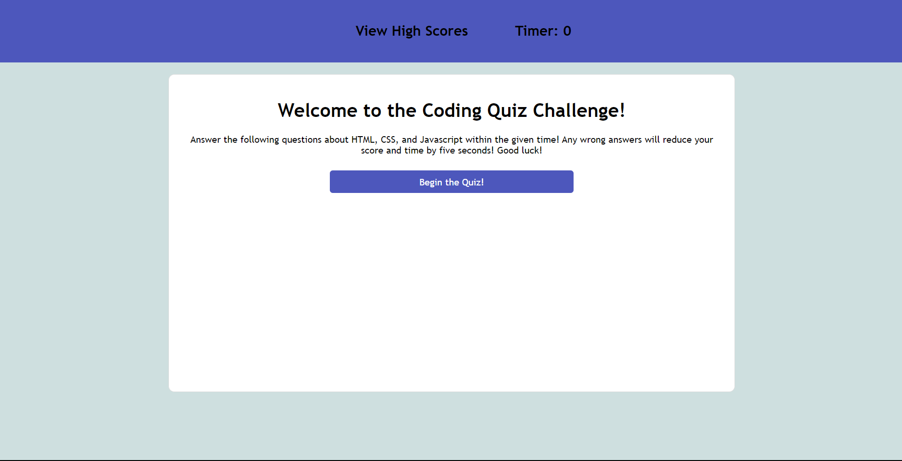
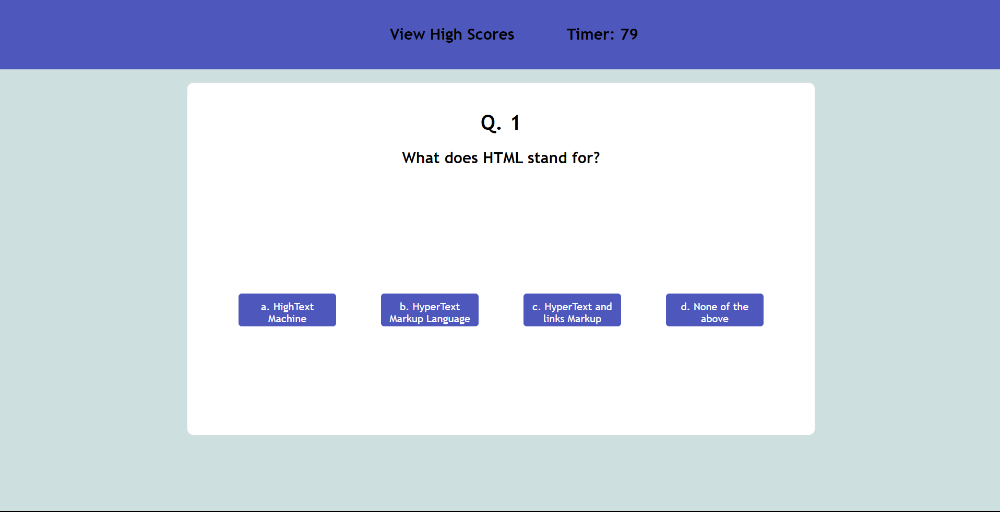
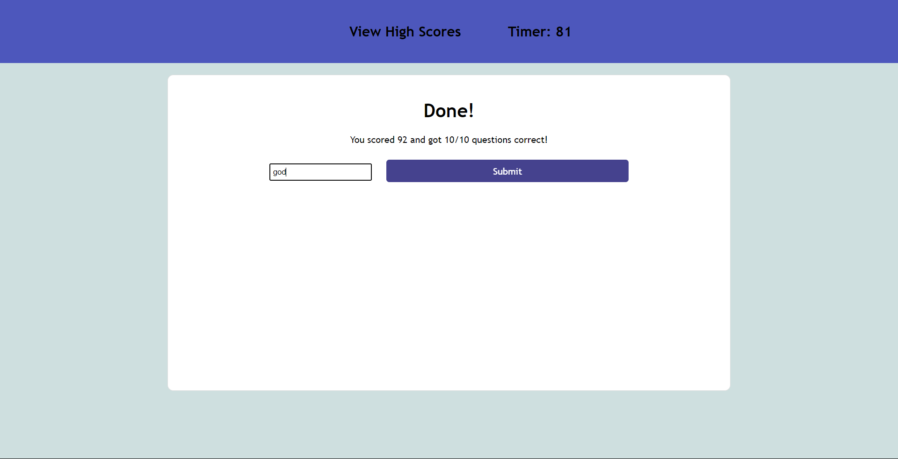
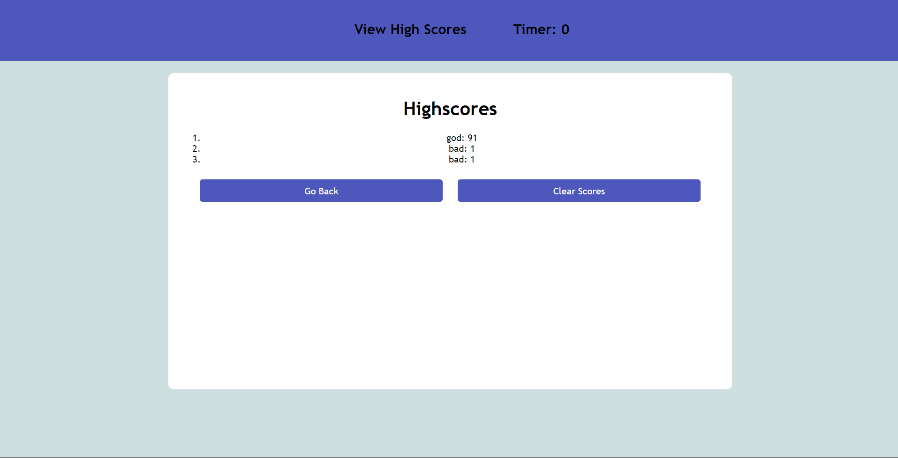

# 04-Timed-Code-Quiz

## Description 

This is a timed, multiple choice quiz testing your knowledge of CSS, HTML, and Javascript made with CSS, HTML, and Javascript from scratch. When you go through and finish this quiz, you will submit your score and initials.

Take the quiz [here](https://abi-gail17.github.io/04-Timed-Code-Quiz/)

## Table of Contents
[Screenshots](#screenshots-of-application)
[Credit](#credit)
[Installation](#installation)
[License](#license)

## Screenshots of Application

## Credit
[HTML quiz questions reference](https://www.javatpoint.com/html-mcq)
[CSS quiz questions reference](https://www.javatpoint.com/css-mcq)
[Javascript quiz questions reference](https://www.javatpoint.com/javascript-mcq)

## Installation

N/A

## License

License in repo